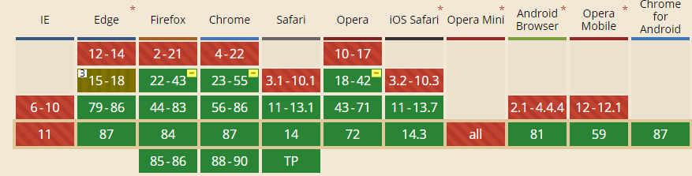
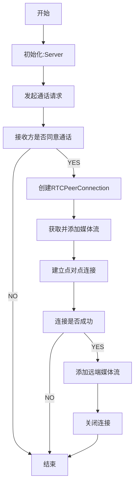
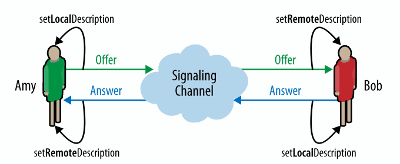
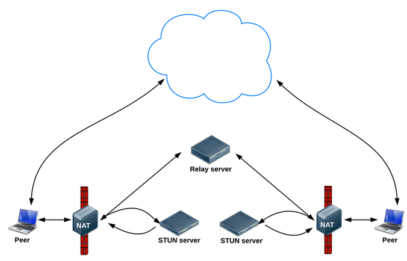

# WebRTC
WebRTC （Web Real-Time Communications） 是一项实时通讯技术，它允许网络应用或者站点，在不借助中间媒介的情况下，建立浏览器之间点对点（Peer-to-Peer）的连接，实现视频流和（或）音频流或者其他任意数据的传输
[MDN 简介](https://developer.mozilla.org/zh-CN/docs/Web/API/WebRTC_API)

### RTCPeerConnection
RTCPeerConnection 对象允许用户在两个浏览器之间直接通讯

### RTCDataChannel
RTCDataChannel 在两者之间建立了一个双向数据通道的连接

### MediaDevices.getUserMedia()
MediaDevices.getUserMedia() 会提示用户给予使用摄像头、麦克风的权限，媒体输入的许可，会产生一个MediaStream，里面包含了请求的媒体类型的轨道（音视频等）。

### MediaDevices.getDisplayMedia()
MediaDevices.getDisplayMedia() 会提示用户去选择和授权捕获展示的内容或部分内容（屏幕、应用程序窗口、浏览器某个标签页），也会产生一个MediaStream. 然后，这个媒体流可以通过使用 MediaStream Recording API 被记录或者作为WebRTC 会话的一部分被传输。
> 兼容性

> WebRTC视频通话流程

### 建立点对点连接过程

### SDP
SDP（Session Description Protocol）是一种通用的会话描述协议，用来描述当前连接者想要传输的内容，支持的协议类型，支持的编解码类型等
WebRTC主要在连接建立阶段用到SDP，连接双方通过信令服务交换会话信息，包括音视频编解码器(codec)、主机候选地址、网络传输协议等。而交换SDP的过程，也称为"媒体协商"

### 地址转换NAT

### STUN
STUN（Session Traversal Utilities for NAT，NAT会话穿越应用程序）是一种网络协议，它允许位于NAT（或多重
NAT）后的客户端找出自己的公网地址，查出自己位于哪种类型的NAT之后以及NAT为某一个本地端口所绑定的
Internet端端口。这些信息被用来在两个同时处于NAT路由器之后的主机之间创建UDP通信

### TURN
TURN的全称为Traversal Using Relays around NAT，是STUN/RFC5389的一个拓展，主要添加了Relay功能。如果
终端在NAT之后， 那么在特定的情景下，有可能使得终端无法和其对等端（peer）进行直接的通信，这时就需要公网
的服务器作为一个中继， 对来往的数据进行转发。这个转发的协议就被定义为TURN

